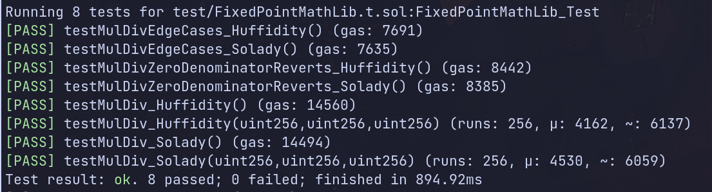

# `huffidity` vs. `solady`

This repo shows a comparison between Solady's `FixedPointMathLib.mulDiv` function and an equivalent implementation in Huff, appended to the tail end of
a Solidity contract using the method laid out in [moodlezoup's `huffidity-poc`](https://github.com/moodlezoup/huffidity-poc).

## Gas snapshot

## Credits
* [huffidity-poc (moodlezoup)](https://github.com/moodlezoup/huffidity-poc)
* [Solady](https://github.com/Vectorized/solady)
